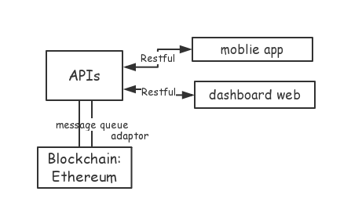
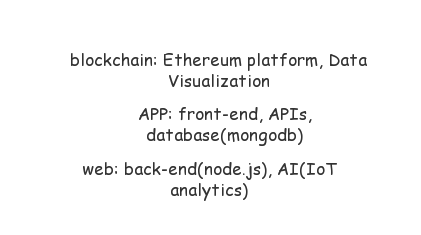

# WEEK1 Report
#### Project：A Reference Model of Applying IoT (Internet of Things) and Blockchain to Enterprise System  
##### Block chain: a distributed, permissioned platform accessible by the supply chain ecosystem designed to exchange events data and handle doc workflows. Characteristic-transparent, democratic, decentralised, efficient and secure.
##### 07/27,08/04 Kick-off meeting – project introduction, member meeting
   
##### week 1 task: Learn modern react with redux (Lectures: 151) in Udemy(https://www.udemy.com/react-redux/learn/v4/overview)
* * *
**Bookmarks** 
- React is a javascript library used to produce HTML shown to user in browser. Const – final value of the variable, cannot change. React is used to create and manage components. ReactDOM is to interact with the actual DOM.
- Components Functional: info goes in, jsx comes out. Simple components, just take a number of properties, and returns some of static jsx. 
```
function Welcome(props) { //props - arbitrary inputs  
return <h1>Hello, {props.name}</h1>;} 
```
- ES6 Class: be aware of states, reacting to user events, keep track of aspects of state from render, is used whenever we wanna have a concept of state in our component.
```
class Welcome extends React.Component {
  render() {
    return <h1>Hello, {this.props.name}</h1>;
  }}
```
- **State:** a plain javascript object that is used to record and react to user events. Each class based components has its own state objects.  

- **Lodash:** A modern JavaScript utility library delivering modularity, performance & extras.  
_.debounce(func, [wait=0], [options={}]): delays invoking func until after wait milliseconds have elapsed since the last time the debounced function was invoked.  

- **Bootstrap Responsive embeds:** Allow browsers to determine video or slideshow dimensions based on the width of their containing block by creating an intrinsic ratio that will properly scale on any device. Rules are directly applied to <iframe>, <embed>, <video>, and <object> elements; optionally use an explicit descendant class .embed-responsive-item when you want to match the styling for other attributes.

- **Redux** is a predictable state container for JavaScript apps, is in charge of and managing application state. State is a single plain JavaScript object. Application state is totally different from component state. Redux serves to construct the application state and react provides the views to display that state. The two libraries are inherently disconnected and only use react-redux that can get clear connection between the two.  

- **Reducers** return a piece of application state, produce values of state. Are all combined together with combineReducers in index.js file of reducers. Reducers are in charge of manipulating/changing the application state over time through using actions.  

- A container is a react component that has a direct connection to the state managed by the redux.  
The search bar need to modify the state over application by dispatching actions, talk to redux where the normal component (- shows some content on the screen) does not.  
Middlewares are functions that are taken in action and depending on the action’s type and the action’s payload.
* * *

##### Resources related to blockchain and IoT:  
[19 Industries The Blockchain Will Disrupt](https://www.youtube.com/watch?v=G3psxs3gyf8&t=148s)  
[IBM and Maersk Demo: Cross-Border Supply Chain Solution on Blockchain](https://www.youtube.com/watch?v=tdhpYQCWnCw )  
[IBM Watson Internet of Things](https://www.youtube.com/channel/UCFNoGF7Ea-FfmAjfK4ReFpA )


